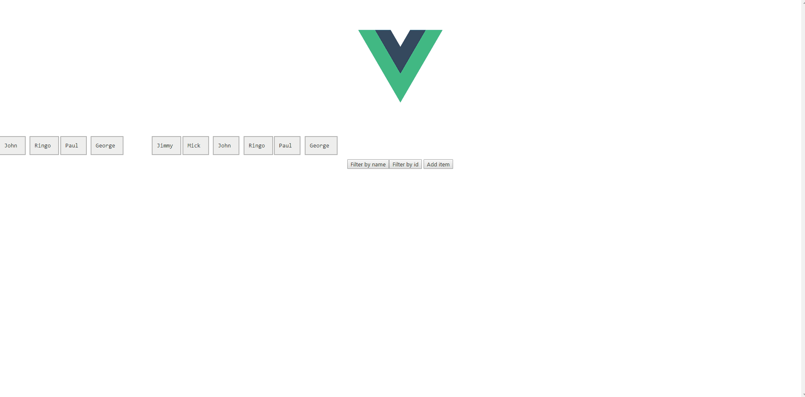

# Vue.ImagesLoaded

[](https://github.com/David-Desmaisons/Vue.ImagesLoaded/issues?q=is%3Aopen+is%3Aissue)
[](https://github.com/David-Desmaisons/Vue.ImagesLoaded/issues?q=is%3Aissue+is%3Aclosed)
[](https://www.npmjs.com/package/vue-images-loaded)
[](https://www.npmjs.com/package/vue-images-loaded)
[](https://vuejs.org/)
[](https://github.com/David-Desmaisons/Vue.ImagesLoaded/blob/master/LICENSE)

A Vue.js 2.0 directive to detect when images have been loaded, based on [imagesLoaded](http://imagesloaded.desandro.com/)

This directive allows to get a callback when children images are loaded in a container element.<br>
Plays nicely with [vue.isotope](https://github.com/David-Desmaisons/Vue.Isotope) to allow re-layout when images are loaded.

## Demo




## Typical usage
```HTML
<div v-images-loaded:on.progress="imageProgress">
	<div v-for="element in list">
		
	</div>
</div>
```

```javascript
import imagesLoaded from 'vue-images-loaded'

export default {
    directives: {
        imagesLoaded
    },
    methods: {
        imageProgress(instance, image ) {
        const result = image.isLoaded ? 'loaded' : 'broken';
        console.log( 'image is ' + result + ' for ' + image.img.src );
    }
```

## Isotope Example
```HTML
<isotope ref="cpt" :options='getOptions()' v-images-loaded:on.progress="layout" :list="list">
    <div v-for="element in list" :key="element.id"  @click="selected=element">
        {{element.name}}
        <br>
        {{element.id}}
        
    </div>
</isotope>
```

```javascript
import imagesLoaded from 'vue-images-loaded'

export default {
    directives: {
        imagesLoaded
    },
    methods: {
        layout () {
            this.$refs.cpt.layout('masonry');
        }     
    }
```

## API

### Using directive
- When used without argument nor modifiers:
```HTML
<div v-images-loaded:"loaded">
```
Directive value:<br>
```javascript
function loaded(instance){
    //...
}
```
loaded is a `Function` triggered after all images have been either loaded or confirmed broken.<br>
Function parameter: ImagesLoaded instance

- When used with `on` argument but no modifiers:
```HTML
<div v-images-loaded.on:"listener">
```
Directive value:<br>
```javascript
listener:{
    done(instance){
        //...
    },
    fail(instance){
        //...
    }
}
```
listener is an `Object` containing callback functions.<br>
Function should be named and will received arguments as described in [Imagesloaded](http://imagesloaded.desandro.com/) 

- When used with `on` argument and modifier:
```HTML
<div v-images-loaded.on.progress:"callback">
```
Directive value:<br>
```javascript
function callback(instance, img){
    //...
}
```
callback is a `Function` triggered acording to modifier name `always`, `done`, `fail`, `progress`.<br>
Function parameter: ImagesLoaded instance, and image information for `progess` only.

### ImagesLoaded instance

- Properties:
    - imagesLoaded.images<br>

        `Array` of LoadingImage instances for each image detected<br>

### LoadingImage instance

- Property:
    - LoadingImage.img

        `Image` - The img element

    - LoadingImage.isLoaded

        `Boolean` - true when the image has succesfully loaded


## Installation
- Available through bower and npm:
``` js
 npm install vue-images-loaded --save
```
``` js
 bower install vue.ImagesLoaded -save
```

- #### For Modules

  ``` js
  // ES6
  import imagesLoaded from 'vue-images-loaded'
  ...
  export default {
        directives: {
            imagesLoaded,
        }
    ...
  
  // ES5
  var imagesLoaded = require('vue-images-loaded')
  ```

- #### For `<script>` Include

  Just include `vueimagesloaded.js` after `imagesloaded.pkgd.min.js` script.<br>

